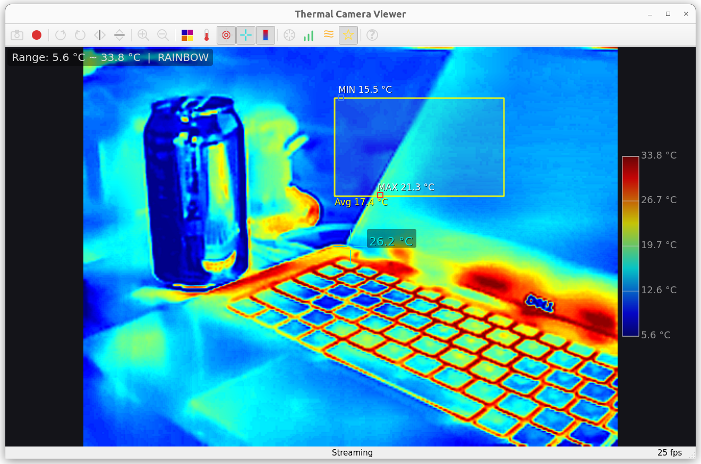

# Thermal Camera Viewer

A desktop application and virtual webcam driver for USB thermal cameras based on the P3/P1 chipset (Vendor ID `0x3474`).

Built on top of [jvdillon/p3-ir-camera](https://github.com/jvdillon/p3-ir-camera) — the original open-source Python driver and protocol documentation for P3-series thermal cameras. This project extends it with a full Qt GUI, installable packages for Linux and macOS, **native Windows viewer support** (same PyUSB stack as upstream), and a plug-and-play UVC virtual webcam driver (**Linux only**).



## Supported Hardware

| Model | PID | Resolution | Frame Rate |
|-------|-----|-----------|------------|
| P3 | `0x45A2` | 256 × 192 | 25 fps |
| P1 | `0x45C2` | 160 × 120 | 25 fps |

These are commonly sold as "Thermal Master P3", "InfiRay P2 Pro", and similar USB-C thermal cameras designed for smartphones. Any camera with VID `0x3474` and one of the above PIDs should work.

## Features

### Viewer Application (Linux, macOS & Windows)

- **Real-time thermal display** at 25 fps with mouse-over temperature readout
- **Region of Interest (ROI)** — drag a box to see max/min/average temperature within the region, with small markers tracking the hottest and coldest points
- **6 color palettes** — White Hot, Black Hot, Rainbow, Ironbow, Military, Sepia
- **Image enhancement** — CLAHE + DDE (Detail Density Enhancement) + temporal noise reduction
- **Screenshot** (PNG) and **video recording** (MP4 via FFmpeg)
- **Rotate** (90° CW/CCW) and **flip** (horizontal/vertical)
- **Zoom** — image-level zoom without window resizing
- **Celsius / Fahrenheit** toggle
- **Center reticle** and **color bar** overlays
- **Hotspot markers** — global max/min temperature points
- **Shutter / NUC** trigger, gain mode toggle, emissivity cycling
- **Adaptive UI** — font sizes scale with window size; crosshair cursor on hover

### UVC Virtual Webcam (Linux only)

- **Plug-and-play** — camera automatically appears as `/dev/video10` when plugged in, disappears when unplugged
- **Zero-config** — no `sudo` or manual commands needed after install
- **Power-saving standby** — physical camera stays idle when no app is reading the virtual webcam; wakes automatically when an app opens the device
- **Works with any V4L2 app** — Zoom, VLC, OBS, Google Meet, Cheese, etc.

## Installation

### Linux (Ubuntu / Debian)

#### Prerequisites

Ubuntu 22.04+ or Debian 12+ (x86_64). The `.deb` package declares all dependencies; `apt` will install any missing ones.

#### Build & Install

```bash
git clone https://github.com/skywalker1905/thermal-camera-viewer.git
cd thermal-camera-viewer
./install.sh
```

The install script automatically builds the `.deb` package if needed, handles upgrades and broken states, and installs all dependencies.

Or build and install manually:

```bash
bash build-deb.sh
sudo dpkg -i thermal-camera-viewer_*.deb
sudo apt-get install -f
```

#### Uninstall (Linux)

```bash
sudo dpkg -r thermal-camera-viewer
```

### macOS

#### Prerequisites

- macOS 12+ (Monterey or later)
- [Homebrew](https://brew.sh)

#### Build & Install

```bash
git clone https://github.com/skywalker1905/thermal-camera-viewer.git
cd thermal-camera-viewer
./install.sh
```

The install script detects macOS, installs dependencies via Homebrew, creates an embedded Python venv inside the app bundle (PEP 668–safe), and copies `Thermal Camera Viewer.app` to `/Applications`.

Or build manually:

```bash
bash build-macos.sh
# Creates: dist/Thermal Camera Viewer.app
# Drag to /Applications or run directly
```

#### Uninstall (macOS)

```bash
rm -rf "/Applications/Thermal Camera Viewer.app"
rm -f /usr/local/bin/thermal-camera-viewer
```

> **Note**: The UVC virtual webcam feature is Linux-only (requires the `v4l2loopback` kernel module). On macOS and Windows, only the viewer application is available.

### Windows

#### Prerequisites

- Windows 10 or 11 (64-bit)
- [Python 3.10+](https://www.python.org/downloads/) on `PATH` (or `winget install Python.Python.3.12`)
- [FFmpeg](https://ffmpeg.org/download.html) on `PATH` if you want **F5 MP4 recording** (optional)
- **USB driver for PyUSB** (same as [upstream p3-ir-camera](https://github.com/jvdillon/p3-ir-camera#usb-driver-windows)): install **WinUSB** for the camera with [Zadig](https://zadig.akeo.ie/) (Options → List All Devices → device with **VID 3474** / PID **45A2** (P3) or **45C2** (P1) → WinUSB → Replace Driver).

#### Install (PowerShell)

From a clone of this repository:

```powershell
cd thermal-camera-viewer
Set-ExecutionPolicy -Scope CurrentUser RemoteSigned -Force   # if scripts are blocked
.\install-windows.ps1
.\.venv\Scripts\python.exe -m thermal_camera_viewer
```

The script creates a project-local `.venv` and installs `PyQt5`, `numpy`, `opencv-python-headless`, `pyusb`, and **`libusb-package`** (ships `libusb-1.0` DLLs used by PyUSB on Windows).

#### Portable / manual pip

```powershell
python -m venv .venv
.\.venv\Scripts\pip install -U pip
.\.venv\Scripts\pip install libusb-package numpy opencv-python-headless pyusb PyQt5
.\.venv\Scripts\python.exe -m thermal_camera_viewer
```

#### Uninstall (Windows)

Delete the project folder (and `.venv`). Remove the WinUSB driver in Device Manager if you need the original OEM driver back.

## Usage

### Viewer

Launch from the application menu or from a terminal:

```bash
thermal-camera-viewer
```

On macOS, open "Thermal Camera Viewer" from the Applications folder or Launchpad.

On Windows, run `python -m thermal_camera_viewer` from the activated `.venv` (see above), or use `py -3.12 -m thermal_camera_viewer` if you installed dependencies globally.

Screenshots and recordings go to **Pictures** and **Videos** under your user profile (`%USERPROFILE%`).

#### Keyboard Shortcuts

| Key | Action |
|-----|--------|
| `Space` | Screenshot (saved to `~/Pictures` on Linux/macOS, `%USERPROFILE%\Pictures` on Windows) |
| `F5` | Start / stop recording (saved to `~/Videos` or `%USERPROFILE%\Videos`; requires `ffmpeg` on `PATH`) |
| `R` | Rotate 90° clockwise |
| `Shift+R` | Rotate 90° counter-clockwise |
| `M` | Flip horizontal (mirror) |
| `V` | Flip vertical |
| `+` / `-` | Zoom in / out |
| `C` | Cycle color palette |
| `F` | Toggle °C / °F |
| `N` | Toggle hotspot markers |
| `T` | Toggle center reticle |
| `B` | Toggle color bar |
| `S` | Trigger shutter / NUC |
| `G` | Toggle gain high / low |
| `E` | Cycle emissivity |
| `P` | Toggle enhanced mode (CLAHE + DDE) |
| `H` | Help |
| `Q` | Quit |

#### Mouse

- **Hover** over the image to see the temperature at the cursor position
- **Click and drag** to draw an ROI box showing max/min/average temperature
- **Right-click** to clear the ROI

### Virtual Webcam (Linux only)

After installation, just plug in the camera. `/dev/video10` appears automatically. Open it in any webcam app:

```bash
# VLC
vlc v4l2:///dev/video10

# FFplay
ffplay /dev/video10

# Cheese
cheese
```

For Zoom / Google Meet: select "ThermalCamera" from the camera dropdown.

When you open the viewer app, it temporarily takes over the camera from the UVC driver. When you close the viewer, the UVC driver automatically resumes within 2 seconds.

## Architecture

The Qt viewer (`viewer.py`) runs on **Linux, macOS, and Windows** (PyUSB + libusb). The **virtual webcam** path (`uvc_driver.py` → v4l2loopback) is **Linux-only**.

### System Components

```
┌──────────────────────────────────────────────────────────────┐
│  USB Camera (VID 0x3474)                                     │
│  256×192 @ 25fps, 16-bit raw thermal + 8-bit IR              │
└──────────────┬───────────────────────────────────────────────┘
               │ USB bulk transfer (pyusb / libusb)
               │
    ┌──────────┴──────────┐
    │                     │
    ▼                     ▼
┌────────────┐    ┌──────────────────┐
│ viewer.py  │    │  uvc_driver.py   │
│ (Qt GUI)   │    │  (Linux only)    │
│            │    │                  │
│ - display  │    │ - colormap       │
│ - ROI      │    │ - CLAHE + DDE    │
│ - record   │    │ - power saving   │
│ - temp     │    │                  │
└────────────┘    └────────┬─────────┘
                           │ ioctl + write()
                           ▼
                  ┌──────────────────┐
                  │  v4l2loopback    │
                  │  /dev/video10    │
                  └────────┬─────────┘
                           │ V4L2 API
                           ▼
                  ┌──────────────────┐
                  │ Zoom / VLC / OBS │
                  └──────────────────┘
```

### Hotplug Lifecycle (Linux)

```
Camera plugged in
  └─ udev rule fires
      └─ hotplug-add.sh (as root)
          ├─ modprobe v4l2loopback → /dev/video10 created
          └─ start uvc-watch (as user)
              └─ uvc-watch (background watcher)
                  └─ spawns uvc_driver.py
                      ├─ no readers → standby (0.5 fps idle frame)
                      └─ reader opens /dev/video10 → stream real thermal

Camera unplugged
  └─ uvc_driver.py detects USB gone → exits
  └─ uvc-watch detects camera_present() false → EXIT trap
      └─ cleanup: kill processes, fuser -k, modprobe -r
          └─ /dev/video10 removed
```

### File Layout

#### Linux (installed via .deb)

```
/opt/thermal-camera-viewer/
├── thermal_camera_viewer/
│   ├── __init__.py          # Package metadata
│   ├── __main__.py          # python -m entry point
│   ├── p3_camera.py         # USB protocol driver
│   ├── viewer.py            # Qt GUI application
│   └── uvc_driver.py        # Virtual webcam streamer
├── hotplug-add.sh           # udev add handler (root)
└── hotplug-remove.sh        # Cleanup helper (root via sudoers)

/usr/bin/
├── thermal-camera-viewer        # Viewer launcher
├── thermal-camera-viewer-uvc    # UVC driver launcher
└── thermal-camera-viewer-uvc-watch  # Lifecycle watcher

/etc/
├── udev/rules.d/99-thermal-camera-viewer.rules
├── modprobe.d/thermal-camera-viewer.conf
└── sudoers.d/thermal-camera-viewer
```

#### macOS (installed via build-macos.sh)

```
/Applications/Thermal Camera Viewer.app/
└── Contents/
    ├── Info.plist
    ├── MacOS/
    │   └── thermal-camera-viewer    # Shell launcher
    └── Resources/
        ├── thermal_camera_viewer/   # Python package
        │   ├── __init__.py
        │   ├── __main__.py
        │   ├── p3_camera.py
        │   ├── viewer.py
        │   └── uvc_driver.py
        └── icon.icns

/usr/local/bin/thermal-camera-viewer   # CLI launcher (symlink)
```

### Source Files

| File | Lines | Description |
|------|-------|-------------|
| `p3_camera.py` | ~1060 | USB protocol driver: connect, configure, stream, parse frames, temperature conversion. Based on the protocol work from [jvdillon/p3-ir-camera](https://github.com/jvdillon/p3-ir-camera). |
| `viewer.py` | ~1190 | Qt5 GUI: thermal rendering, ROI analysis, overlays, recording, toolbar, keyboard shortcuts. |
| `uvc_driver.py` | ~360 | v4l2loopback writer: opens the virtual device via ioctl, streams colormapped RGB frames, power-saving standby mode. Linux only. |
| `build-deb.sh` | ~280 | Debian package builder: generates icons, creates launcher scripts, udev rules, hotplug handlers, and DEBIAN control files. |
| `build-macos.sh` | ~150 | macOS .app bundle builder: generates .icns icon, creates Info.plist, bundles Python package. |

### USB Protocol

The camera uses a proprietary USB bulk transfer protocol:

1. **Connect**: Claim USB interface 1, set alt setting 1
2. **Init**: Send vendor control transfers to get device name and firmware version
3. **Stream**: Continuous bulk reads from endpoint `0x81` in 16 KB chunks
4. **Frame format**: Start marker (12 bytes) + frame data + end marker (12 bytes)
5. **Frame data**: `(2H + 2) × W` rows of 16-bit values
   - Rows `0..H-1`: 8-bit IR image (packed as 16-bit, use lower byte)
   - Rows `H..H+1`: Metadata (calibration parameters, temperature references)
   - Rows `H+2..2H+1`: 16-bit raw thermal data (1/64 Kelvin units)

Temperature conversion: `T(°C) = raw / 64 - 273.15`, with environmental correction from metadata.

For full protocol documentation, see [P3_PROTOCOL.md](https://github.com/jvdillon/p3-ir-camera/blob/main/P3_PROTOCOL.md) in the upstream project.

## Development

### Project Structure

```
thermal-camera-viewer/
├── thermal_camera_viewer/       # Python package
│   ├── __init__.py
│   ├── __main__.py
│   ├── p3_camera.py
│   ├── viewer.py
│   └── uvc_driver.py
├── data/                        # Desktop entry and icons
│   ├── thermal-camera-viewer.desktop
│   └── thermal-camera-viewer-*.png
├── build-deb.sh                 # Linux .deb package builder
├── build-macos.sh               # macOS .app bundle builder
├── install.sh                   # Linux / macOS installer
├── install-windows.ps1          # Windows: venv + pip dependencies
├── pyproject.toml               # Python project metadata
├── .gitignore
├── LICENSE
└── README.md
```

### Running from Source

#### Linux

```bash
sudo apt install python3-pyqt5 python3-numpy python3-opencv python3-usb \
                 libusb-1.0-0 ffmpeg v4l2loopback-dkms

echo 'SUBSYSTEM=="usb", ATTR{idVendor}=="3474", MODE="0666"' | \
  sudo tee /etc/udev/rules.d/99-thermal-camera.rules
sudo udevadm control --reload-rules

python3 -m thermal_camera_viewer
```

#### macOS

```bash
brew install libusb ffmpeg python@3
pip3 install pyqt5 numpy opencv-python-headless pyusb

python3 -m thermal_camera_viewer
```

#### Windows

```powershell
# After .\install-windows.ps1 (or equivalent pip install into .venv)
.\.venv\Scripts\python.exe -m thermal_camera_viewer
```

Use **Zadig + WinUSB** for the camera before first run; see [p3-ir-camera — USB driver (Windows)](https://github.com/jvdillon/p3-ir-camera#usb-driver-windows).

### Building

```bash
# Linux
bash build-deb.sh

# macOS
bash build-macos.sh
```

There is no bundled `.exe` installer yet; on Windows use `install-windows.ps1` or `pip install -e ".[windows]"` from a checkout.

## Acknowledgments

- [jvdillon/p3-ir-camera](https://github.com/jvdillon/p3-ir-camera) — the original open-source P3/P1 camera driver and protocol documentation that this project is built upon
- USB protocol reverse engineering by [@aeternium](https://github.com/jvdillon/p3-ir-camera/issues/2)
- [v4l2loopback](https://github.com/umlaeute/v4l2loopback) kernel module for virtual webcam support on Linux

## License

Licensed under the **Apache License, Version 2.0** (same as upstream
[p3-ir-camera](https://github.com/jvdillon/p3-ir-camera)). See `LICENSE`.
The driver in `thermal_camera_viewer/p3_camera.py` is derived from that
project; see `NOTICE` for attribution.
